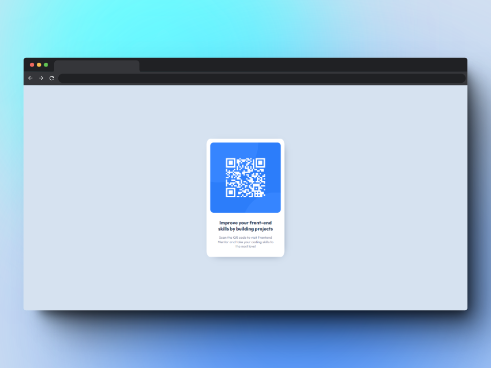

# Frontend Mentor - QR code component solution

This is a solution to the [QR code component challenge on Frontend Mentor](https://www.frontendmentor.io/challenges/qr-code-component-iux_sIO_H). Frontend Mentor challenges help you improve your coding skills by building realistic projects.

## Table of contents

-   [Overview](#overview)
    -   [Screenshot](#screenshot)
    -   [Links](#links)
-   [My process](#my-process)
    -   [Built with](#built-with)
    -   [What I learned](#what-i-learned)
    -   [Useful resources](#useful-resources)
-   [Author](#author)

## Overview

### Screenshot

### Links

-   Solution URL: [Add solution URL here](https://your-solution-url.com)
-   Live Site URL: [Add live site URL here](https://your-live-site-url.com)

## My process

### Built with

-   Semantic HTML5 markup
-   CSS custom properties
-   Flexbox

### What I learned

I tried to create a QR code component and make it look as similar to the design as possible. By learning Semantic HTML5 markup, simple CSS custom properties, and Flexbox.

### Useful resources

-   [CSS Variables - The var() Function](https://www.w3schools.com/css/css3_variables.asp) - This helped me for understanding of var() function. I really liked this pattern and will use it going forward.
-   [Shots](https://shots.so/) - for Create Amazing Mockups.

## Author

-   Frontend Mentor - [@hasta-logia](https://www.frontendmentor.io/profile/hasta-logia)

## Acknowledgments

This is where you can give a hat tip to anyone who helped you out on this project. Perhaps you worked in a team or got some inspiration from someone else's solution. This is the perfect place to give them some credit.
